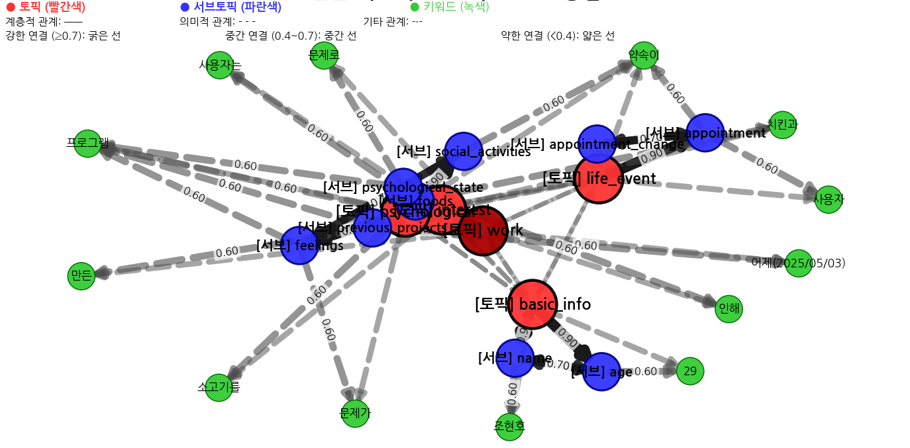
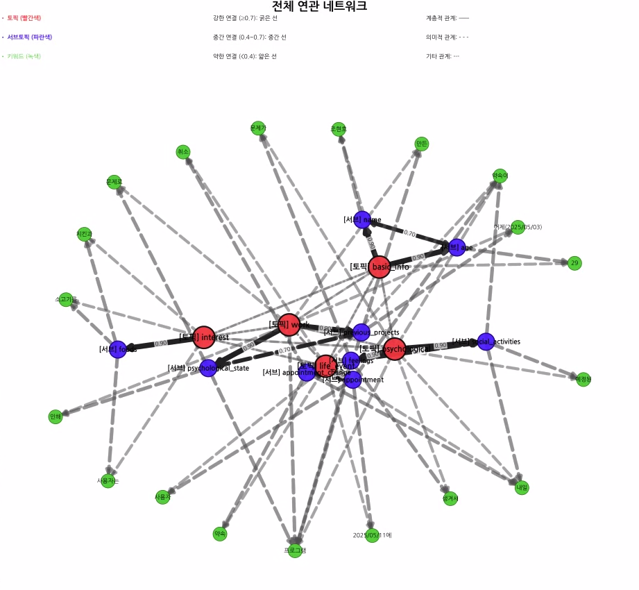
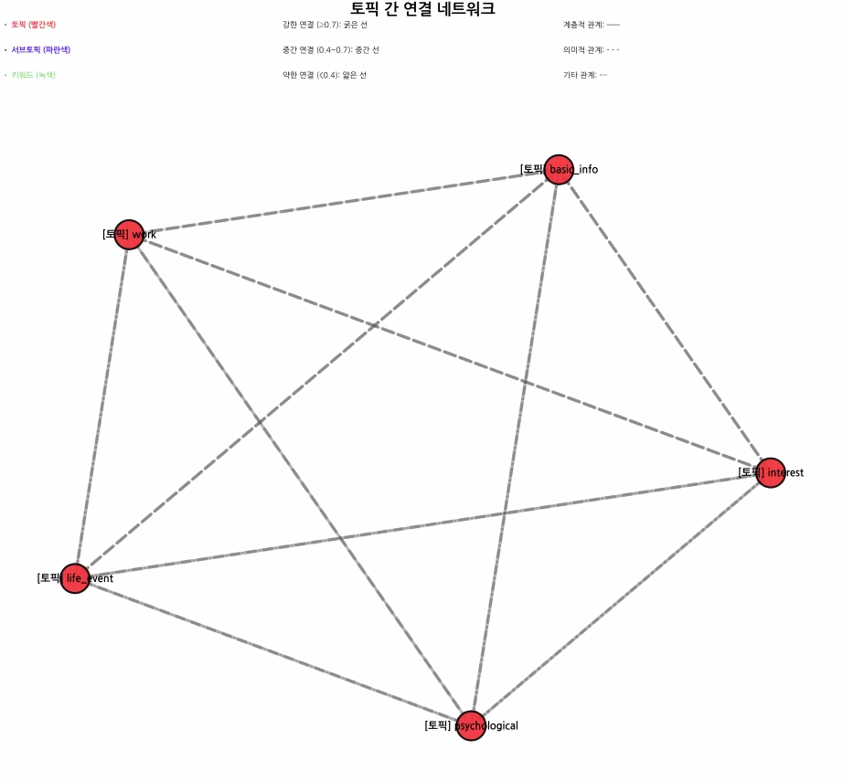
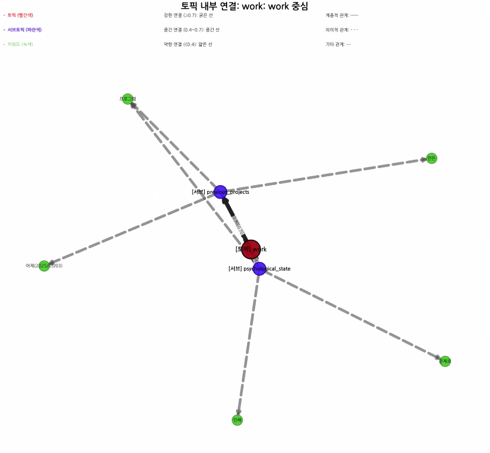

# 토픽과 서브토픽 연결 시스템

## 소개 👋

안녕하세요! 이 프로젝트는 토픽(상위개념)과 서브토픽(하위개념) 간의 연결 강도를 자동으로 관리하고 시각화하는 시스템입니다. JSON 형태의 데이터가 입력되면 개념 간의 연결 관계를 자동으로 형성하고, 시간이 지남에 따라 중요도가 낮은 정보는 장기 기억으로 이동시키는 지능적인 메모리 관리 시스템입니다.




## 이 시스템으로 무엇을 할 수 있나요? 🚀

- ✅ 토픽과 서브토픽 간의 **연결 관계를 자동으로 생성**
- ✅ 서로 다른 토픽 간의 **관련성을 공유 서브토픽 기반으로 계산**
- ✅ 개념 간 연결을 **시각적으로 표현**하여 정보 구조 파악
- ✅ 약한 연결을 가진 개념들을 **자동으로 장기 기억으로 이동**
- ✅ 메모리를 계층(단기/장기)별로 효율적으로 관리

## 시작하기 🏁

### 1. 필요한 패키지를 지원하는 가상환경을 생성하기

```bash
conda env create -f environment.yml
```

또는 아래 명령어로 개별 설치:

```bash
pip install chromadb sentence-transformers networkx matplotlib psutil aiohttp pybloom-live
```

### 2. 대화형 테스트 실행하기

```bash
python interactive_test.py
```

외부 JSON 파일을 사용하려면:

```bash
python interactive_test.py -f your_data.json
```

## 데이터 형식 📊

시스템이 처리하는 JSON 데이터는 다음과 같은 형식을 가집니다:

```json
[
  {
    "user_id": "user1",
    "topic": "basic_info", // 토픽(상위개념)
    "sub_topic": "name", // 서브토픽(하위개념)
    "memo": "홍길동" // 메모 내용
  },
  {
    "user_id": "user1",
    "topic": "work",
    "sub_topic": "project",
    "memo": "AI 개발"
  }
]
```

## 메모리 관리 구조 💾

이 시스템은 3단계 메모리 구조를 사용합니다:

1. **초단기 기억 시스템**: JSON 형태로 입력되는 토픽, 서브토픽, 메모 데이터
2. **단기 기억(SQLite)**: 자주 사용되고 강한 연결을 가진 개념들 저장
3. **장기 기억(벡터DB)**: 자주 사용되지 않거나 연결이 약한 개념들 저장

### 초단기 기억 시스템 & JSON 데이터

초단기 기억 시스템은 JSON 데이터를 제공합니다. 테스트/개발 단계에서는 다음과 같은 방식으로 데이터가 관리됩니다:

- **샘플 파일**: `sample_topics.json` 파일에 저장됨 (기본 위치: 프로젝트 루트 디렉토리)
- **하드코딩된 데이터**: 테스트 스크립트 내 `TEST_JSON_DATA` 또는 `SAMPLE_JSON_DATA` 변수에 정의
- **사용자 지정 파일**: `-f` 옵션으로 외부 JSON 파일 지정 가능

실제 운영 환경에서는 외부 API를 통해 JSON 데이터를 받아오도록 설계되었습니다.

## 데이터 소스 상세 설명 💾

### 샘플 데이터의 출처와 흐름

`interactive_test.py`가 사용하는 토픽/서브토픽 데이터의 정확한 흐름은 다음과 같습니다:

1. **샘플 데이터 정의**: 
   - 샘플 데이터는 `json_file_handler.py` 파일 내의 `create_sample_json_file()` 함수에 하드코딩되어 있습니다.
   - 이 데이터는 토픽, 서브토픽, 메모 등의 정보를 포함하고 있으며, 시각화에 사용될 네트워크 구조의 기반이 됩니다.

2. **샘플 파일 생성 및 로드**:
   - 프로그램이 처음 실행될 때, JSON 파일 경로가 제공되지 않거나 파일이 존재하지 않으면 `create_sample_json_file()` 함수가 호출됩니다.
   - 이 함수는 하드코딩된 샘플 데이터를 `sample_topics.json` 파일로 저장합니다.
   - 그 후 `load_json_topics_from_file()` 함수가 이 파일에서 데이터를 로드합니다.

3. **그래프 구축 프로세스**:
   - 메뉴 1번("네트워크 그래프 직접 구축")을 선택하면, **이미 로드된 JSON 데이터**를 사용하여 그래프를 구축합니다.
   - 이 과정에서 새로운 데이터가 생성되거나 파일이 수정되지 않습니다.
   - 단지 로드된 데이터를 기반으로 메모리 내 그래프 구조를 만들 뿐입니다.

### 중요 참고사항

- **메뉴 1번 선택 효과**: 메뉴 1번을 누르면 새로운 데이터가 생성되거나 파일이 다시 만들어지지 않습니다. 데이터는 프로그램 시작 시 이미 로드되어 있으며, 1번 메뉴는 단지 이 데이터로 그래프를 구축합니다.

- **데이터 수정 방법**: 시각화되는 데이터를 변경하려면, `json_file_handler.py` 파일의 `create_sample_json_file()` 함수에 있는 샘플 데이터를 수정하거나, `-f` 옵션을 사용하여 자신만의 JSON 파일을 지정하면 됩니다.

### 외부 JSON 파일 사용하기 🔄

프로그램은 기본적으로 내장된 샘플 데이터를 사용하지만, 사용자가 직접 만든 데이터로 시스템을 테스트하거나 실제 사용 시나리오를 모델링하고 싶을 수 있습니다. 다음은 외부 JSON 파일을 사용하는 방법에 대한 상세 가이드입니다:

#### 1. 외부 JSON 파일 형식
외부 파일은 다음과 같은 형식을 따라야 합니다:
```json
[
  {
    "user_id": "user1",
    "topic": "학업",
    "sub_topic": "수학",
    "memo": "미적분학 공부 중"
  },
  {
    "user_id": "user1",
    "topic": "학업",
    "sub_topic": "영어",
    "memo": "토익 시험 준비"
  },
  {
    "user_id": "user1",
    "topic": "취미",
    "sub_topic": "독서",
    "memo": "소설 읽기 좋아함"
  }
]
```

각 항목은 다음 필드를 포함해야 합니다:
- `user_id`: 사용자 식별자 (문자열)
- `topic`: 토픽(상위개념) 이름 (문자열)
- `sub_topic`: 서브토픽(하위개념) 이름 (문자열)
- `memo`: 메모 내용 (문자열)

#### 2. 프로그램 실행 시 외부 파일 지정
명령행에서 `-f` 또는 `--file` 옵션을 사용하여 외부 JSON 파일을 지정할 수 있습니다:

```bash
python interactive_test.py -f your_custom_data.json
```

이 명령을 실행하면:
1. 프로그램은 샘플 파일을 생성하는 대신 지정한 외부 파일을 로드합니다.
2. 로드된 데이터를 사용하여 토픽/서브토픽 관계를 설정하고 시각화합니다.

#### 3. 외부 파일 사용 시 주의사항
- 파일 형식: JSON 배열 형식을 정확히 준수해야 합니다.
- 인코딩: UTF-8 인코딩을 사용하여 한글이나 특수문자가 깨지지 않도록 합니다.
- 필드 이름: 필드 이름(`user_id`, `topic`, `sub_topic`, `memo`)을 정확히 사용해야 합니다.
- 데이터 일관성: 동일한 사용자에 대한 데이터를 사용하여 일관된 연결 구조를 만드는 것이 좋습니다.

#### 4. 외부 파일 예시
다음은 실제 사용 가능한 외부 파일 예시입니다:

**work_projects.json**:
```json
[
  {
    "user_id": "john",
    "topic": "project_a",
    "sub_topic": "planning",
    "memo": "초기 기획 단계, 요구사항 분석 필요"
  },
  {
    "user_id": "john",
    "topic": "project_a",
    "sub_topic": "resources",
    "memo": "개발자 2명, 디자이너 1명 배정됨"
  },
  {
    "user_id": "john",
    "topic": "project_b",
    "sub_topic": "deadline",
    "memo": "6월 15일까지 완료 예정, 시간 촉박함"
  },
  {
    "user_id": "john",
    "topic": "project_b",
    "sub_topic": "status",
    "memo": "현재 70% 진행, 테스트 단계 남아있음"
  }
]
```

이 파일을 사용하여 프로그램을 실행하려면:
```bash
python interactive_test.py -f work_projects.json
```

이렇게 하면 `project_a`와 `project_b` 토픽, 그들의 서브토픽, 그리고 메모에서 추출된 키워드 사이의 연결을 시각화할 수 있습니다.

## 데이터 저장 방식 및 기술 아키텍처 🗄️

### 그래프 데이터 저장 방식 (개발자용)

시스템에서 그래프는 SQLite와 메모리 내 NetworkX 객체의 하이브리드 방식으로 관리됩니다:

#### 1. **SQLite 테이블 구조**

시스템은 다음 테이블들을 사용하여 그래프 데이터를 저장합니다:

**`memories` 테이블**: 기본 메모리 엔트리 저장

```sql
CREATE TABLE IF NOT EXISTS memories (
    id TEXT PRIMARY KEY,
    content TEXT NOT NULL,      -- JSON 형식의 콘텐츠
    concepts TEXT NOT NULL,     -- JSON 배열로 저장된 관련 개념들
    importance REAL DEFAULT 0.5, -- 중요도
    emotional_weight REAL DEFAULT 0.0, -- 감정적 가중치
    access_count INTEGER DEFAULT 0, -- 접근 횟수
    tier TEXT NOT NULL,         -- 메모리 계층 (SHORT_TERM/LONG_TERM)
    metadata TEXT,              -- JSON 형식의 메타데이터
    last_accessed TIMESTAMP,    -- 마지막 접근 시간
    creation_time TIMESTAMP NOT NULL -- 생성 시간
)
```

**`concepts` 테이블**: 메모리에 연결된 개념 저장

```sql
CREATE TABLE IF NOT EXISTS concepts (
    id INTEGER PRIMARY KEY AUTOINCREMENT,
    concept TEXT NOT NULL,      -- 개념명
    memory_id TEXT NOT NULL,    -- 연결된 메모리 ID
    FOREIGN KEY (memory_id) REFERENCES memories(id)
)
```

**`concept_connections` 테이블**: 개념 간 연결 정보 저장

```sql
CREATE TABLE IF NOT EXISTS concept_connections (
    id INTEGER PRIMARY KEY AUTOINCREMENT,
    source_concept TEXT NOT NULL, -- 출발 개념
    target_concept TEXT NOT NULL, -- 도착 개념
    weight REAL DEFAULT 0.5,      -- 연결 강도
    connection_type TEXT DEFAULT 'semantic', -- 연결 유형
    strengthening_count INTEGER DEFAULT 1,   -- 강화 횟수
    last_updated TIMESTAMP NOT NULL,         -- 마지막 업데이트 시간
    creation_time TIMESTAMP NOT NULL,        -- 생성 시간
    UNIQUE(source_concept, target_concept)   -- 중복 방지
)
```

#### 2. **메모리 내 그래프 구성 과정**

1. **로드 프로세스**:

   ```python
   # sqlite_storage.py 내부에서 연결 정보 로드
   async def load_connections(self):
       with sqlite3.connect(self.db_path) as conn:
           cursor = conn.cursor()
           cursor.execute('SELECT source_concept, target_concept, weight, connection_type FROM concept_connections')
           connections = cursor.fetchall()
           return connections

   # association_network.py에서 그래프 구성
   def build_graph(self, connections):
       for source, target, weight, conn_type in connections:
           self.add_concept(source)
           self.add_concept(target)
           self.connect_concepts(
               source, target,
               connection_type=ConnectionType(conn_type),
               custom_strength=weight
           )
   ```

2. **저장 프로세스**:

   ```python
   # association_network.py에서 변경사항 감지
   def save_changes(self):
       changes = self._detect_changes()
       return self._serialize_changes(changes)

   # sqlite_storage.py에서 변경사항 저장
   async def save_concept_connection(self, source, target, weight, conn_type):
       # 새 연결이면 INSERT, 기존 연결이면 UPDATE
       with sqlite3.connect(self.db_path) as conn:
           cursor = conn.cursor()
           # 중복 확인 및 저장 로직
           # ...
   ```

#### 3. **직렬화 및 역직렬화 세부 과정**

1. **직렬화 (메모리 → DB)**:

   - `NetworkX 그래프 → 파이썬 데이터 구조 → SQLite 테이블`
   - 노드 속성은 `JSON.dumps()`로 직렬화하여 저장
   - 엣지 속성은 개별 컬럼으로 분해하여 저장

2. **역직렬화 (DB → 메모리)**:

   - `SQLite 테이블 → 파이썬 데이터 구조 → NetworkX 그래프`
   - SQL 쿼리로 노드와 엣지 정보 조회
   - 노드 속성은 `JSON.loads()`로 파싱
   - 엣지와 노드를 NetworkX 그래프에 추가

3. **트랜잭션 처리**:
   - 대량 변경 시 `conn.executemany()`로 성능 최적화
   - 모든 그래프 조작 작업은 SQLite 트랜잭션으로 묶음
   - 에러 발생 시 롤백하여 데이터 일관성 유지

#### 4. **인덱싱 전략**

효율적인 검색을 위해 다음 인덱스를 사용합니다:

```sql
CREATE INDEX IF NOT EXISTS idx_concepts ON memories(concepts);
CREATE INDEX IF NOT EXISTS idx_concept_text ON concepts(concept);
CREATE INDEX IF NOT EXISTS idx_source_concept ON concept_connections(source_concept);
CREATE INDEX IF NOT EXISTS idx_target_concept ON concept_connections(target_concept);
CREATE INDEX IF NOT EXISTS idx_connection_weight ON concept_connections(weight);
```

## 대화형 테스트 메뉴 가이드 🧭

`interactive_test.py`를 실행하면 다음과 같은 메뉴가 표시됩니다:


### 1️⃣ 네트워크 그래프 직접 구축하기

**무엇을 하나요?** JSON 데이터에서 토픽과 서브토픽을 추출하여 연관 네트워크를 처음부터 구축합니다.

**실행하면:**
- 토픽, 서브토픽, 키워드가 그래프의 노드로 추가됩니다
- 토픽-서브토픽 간 계층적 관계(강도 0.9)가 설정됩니다
- 서브토픽 간 의미적 관계(강도 0.7)가 설정됩니다
- 토픽 간 관계는 공유 서브토픽 수에 기반하여 설정됩니다

### 2️⃣ 토픽/서브토픽 관계 설정하기

**무엇을 하나요?** 기존 API를 사용하여 토픽과 서브토픽 간 관계를 설정합니다.

**실행하면:**
- 메모리 매니저를 통해 자동으로 관계가 설정됩니다
- 1번 메뉴와 결과는 유사하지만 내부 처리 방식이 다릅니다

### 3️⃣ 모든 연결 시각화하기


**무엇을 하나요?** 모든 토픽, 서브토픽 및 그들 간의 연결을 포함한 전체 그래프를 시각화합니다.

**실행하면:**
- 전체 그래프 구조가 시각화됩니다
- 토픽은 **빨간색**, 서브토픽은 **파란색**, 키워드는 **녹색**으로 표시됩니다
- 연결 강도는 선의 두께와 색상으로 표현됩니다
- 계층적 관계는 실선, 의미적 관계는 점선으로 표시됩니다
- PNG 파일로 저장됩니다

### 4️⃣ 토픽 간 연결 시각화하기


**무엇을 하나요?** 토픽 노드들과 그들 간의 연결만 시각화합니다.

**실행하면:**
- 토픽 노드들(빨간색)만 포함된 그래프가 시각화됩니다
- 서브토픽과 키워드는 표시되지 않습니다
- 토픽 간 연결 강도는 공유 서브토픽 수에 기반하여 표현됩니다
- PNG 파일로 저장됩니다

### 5️⃣ 특정 토픽 내부 연결 시각화하기


**무엇을 하나요?** 선택한 특정 토픽과 그에 직접 연결된 서브토픽 및 키워드만 시각화합니다.

**실행하면:**
- 토픽을 선택할 수 있습니다
- 선택한 토픽과 그에 직접 연결된 서브토픽 및 키워드만 시각화됩니다
- 다른 토픽들은 표시되지 않습니다
- 계층적 관계는 실선으로, 의미적 관계는 점선으로 표시됩니다
- PNG 파일로 저장됩니다

### 6️⃣ 약한 연결 찾기 및 메모리 승격하기

**무엇을 하나요?** 연결 강도가 낮은 개념들을 찾아 장기 기억으로 승격시킵니다.

**실행하면:**
- 연결 강도 임계값을 설정할 수 있습니다 (기본: 0.5)
- 임계값 이하의 약한 연결 목록이 표시됩니다
- 확인 후 관련 메모리를 장기 기억으로 승격시킬 수 있습니다

### 7️⃣ 모든 토픽 연결 통계 보기

**무엇을 하나요?** 토픽별 연결 통계 정보를 표시합니다.

**실행하면:**
- 각 토픽의 총 연결 수가 표시됩니다
- 강한 연결, 중간 연결, 약한 연결로 분류된 통계가 표시됩니다
- 각 카테고리별 몇 가지 예시 연결이 표시됩니다

### 8️⃣ 그래프 내 모든 개념 보기

**무엇을 하나요?** 현재 그래프에 있는 모든 개념(노드)을 나열합니다.

**실행하면:**
- 모든 노드 목록이 번호와 함께 표시됩니다
- 총 개념 수가 표시됩니다

### 9️⃣ JSON 데이터 보기

**무엇을 하나요?** 현재 로드된 JSON 데이터를 확인합니다.

**실행하면:**
- 처음 5개의 JSON 데이터 항목이 표시됩니다
- 총 항목 수가 표시됩니다

### 0️⃣ 종료

**무엇을 하나요?** 프로그램을 종료합니다.

**실행하면:**
- 프로그램 종료 전 필요한 리소스를 정리합니다
- "프로그램 종료" 메시지가 표시됩니다

### 1번과 2번 메뉴의 차이점 📋

많은 사용자들이 메뉴 1번("네트워크 그래프 직접 구축")과 메뉴 2번("토픽/서브토픽 관계 설정")의 차이에 대해 궁금해합니다. 두 메뉴 모두 토픽과 서브토픽 간의 관계를 설정하지만, 내부적인 처리 방식에 차이가 있습니다:

#### 1번 메뉴 (네트워크 그래프 직접 구축)
- **직접적인 그래프 생성**: `build_graph_directly()` 함수를 사용하여 JSON 데이터에서 토픽과 서브토픽을 추출하고 그래프를 직접 구축합니다.
- **처리 과정**:
  1. JSON 데이터에서 토픽과 서브토픽 구조를 추출합니다.
  2. 토픽과 서브토픽을 그래프의 노드로 직접 추가합니다.
  3. 계층적 관계(토픽→서브토픽), 의미적 관계(서브토픽↔서브토픽), 토픽 간 연결 등을 직접 설정합니다.
  4. 메모에서 키워드를 추출하여 토픽 및 서브토픽에 연결합니다.
- **사용 시나리오**: 그래프 구조와 연결 과정을 명확하게 제어하고 싶을 때 사용합니다.

#### 2번 메뉴 (토픽/서브토픽 관계 설정)
- **API 활용 접근**: 챗봇의 `memory_manager.save_topic_subtopic_relations()` 메서드를 사용하여 관계 설정을 위임합니다.
- **처리 과정**:
  1. 메모리 매니저에게 JSON 데이터를 전달합니다.
  2. 메모리 매니저는 데이터를 분석하고, 연결 타입을 자동으로 추론합니다.
  3. 메모 내용 분석을 통해 시간적/감정적 관계 등도 자동으로 식별합니다.
  4. 추출된 관계 정보를 저장소(SQLite)에도 저장합니다.
- **사용 시나리오**: 시스템의 자동 추론 기능을 활용하고 싶거나, 메모리 저장소와 통합하고 싶을 때 사용합니다.

#### 결과 차이
- **시각적 결과**: 두 메뉴 모두 유사한 시각화 결과를 보여주지만, 메뉴 2번은 메모 내용 분석 기반의 관계 추론이 추가로 이루어질 수 있습니다.
- **저장소 통합**: 메뉴 2번은 관계 정보를 SQLite에도 저장하지만, 메뉴 1번은 메모리 내 그래프만 구축합니다.
- **성능**: 메뉴 1번은 메모리 내 직접 구축으로 약간 더 빠를 수 있지만, 일반적인 사용에서는 큰 차이가 없습니다.

#### 어떤 메뉴를 선택해야 할까요?
- **일반적인 사용**: 대부분의 경우 메뉴 1번으로 충분합니다.
- **고급 분석 필요**: 메모 내용 분석을 통한 자동 관계 추론이 필요하면 메뉴 2번을 사용하세요.
- **저장소 활용**: 관계 정보를 SQLite에 저장하여 나중에 참조하려면 메뉴 2번을 사용하세요.

두 메뉴 모두 프로그램 시작 시 로드된 동일한 JSON 데이터를 사용하며, 새로운 데이터를 생성하거나 파일을 수정하지 않습니다.

## 연결 관계 유형 이해하기 🔄

이 시스템에서는 다양한 유형의 연결 관계를 관리합니다. 각 관계 유형은 시각화에서 다른 선 스타일로 표현됩니다.

### 관계 유형 판단 방식

시스템이 관계 유형을 판단하는 방식은 다음과 같습니다:

1. **명시적 설정**: `connect_concepts` 함수 호출 시 `connection_type` 매개변수로 직접 지정
2. **자동 추론**: 다음과 같은 규칙에 따라 자동으로 판단
   - 토픽-서브토픽 관계: 계층적 관계(HIERARCHICAL)로 설정
   - 같은 토픽의 서브토픽 간 관계: 의미적 관계(SEMANTIC)로 설정
   - 시간 관련 단어가 포함된 관계: 시간적 관계(TEMPORAL)로 추론
   - 감정 표현이 포함된 관계: 감정적 관계(EMOTIONAL)로 추론

### 계층적 관계 (Hierarchical)


- **어떤 관계인가요?** 상위개념이 하위개념을 포함하는 관계입니다
- **어떻게 표시되나요?** **실선**으로 표시됩니다
- **연결 강도는?** 0.9 (매우 강함)
- **예시:** "basic_info" → "name" (basic_info 토픽은 name 서브토픽을 포함함)

### 의미적 관계 (Semantic)


- **어떤 관계인가요?** 의미적으로 관련된 개념들 간의 관계입니다
- **어떻게 표시되나요?** **점선**으로 표시됩니다
- **연결 강도는?**
  - 서브토픽 간: 0.7 (중간 강도)
  - 토픽 간: 공유 서브토픽 수에 따라 0.4~0.9
- **예시:** "name" ↔ "age" (같은 basic_info 토픽에 속한 서브토픽들)

### 시간적 관계 (Temporal)

- **어떤 관계인가요?** 선후 관계를 가진 개념들 간의 관계입니다
- **어떻게 표시되나요?** **대시-점선**으로 표시됩니다
- **자동 판단:** 날짜 패턴(YYYY/MM/DD), "어제", "내일" 등의 시간 표현이 메모에 있으면 감지
- **예시:** "previous_projects" ↔ "appointment" (시간적 선후 관계가 있는 개념들)

### 감정적 관계 (Emotional)

- **어떤 관계인가요?** 감정적 연관이 있는 개념들 간의 관계입니다
- **어떻게 표시되나요?** **점선**으로 표시됩니다
- **자동 판단:** "스트레스", "불만족감", "피로감" 등 감정 단어가 메모에 포함되면 감지
- **예시:** "psychological_state" ↔ "feelings" (감정적 연관성이 있는 개념들)

## 연결 강도 계산 방식 💪


### 토픽 → 서브토픽

- **강도:** 0.9 (고정값)
- **의미:** 가장 강한 계층적 관계

### 서브토픽 ↔ 서브토픽

- **강도:** 0.7 (고정값)
- **의미:** 같은 토픽에 속한 서브토픽들 간의 중간 강도 관계

### 토픽 ↔ 토픽

- **계산식:** 0.5 + (공유 서브토픽 수 × 0.1), 최대 0.9
- **의미:** 공유 서브토픽이 많을수록 토픽 간 연관성이 강함
- **최소값:** 공유 서브토픽이 없는 경우 0.4

### 토픽/서브토픽 → 키워드

- **강도:**
  - 토픽-키워드: 0.5
  - 서브토픽-키워드: 0.6

## 시각화 결과 읽는 법 👁️


### 노드 색상으로 개념 유형 구분하기

- **빨간색 노드:** 토픽 (상위개념)
- **파란색 노드:** 서브토픽 (하위개념)
- **녹색 노드:** 키워드 (메모에서 추출된 중요 단어)

### 선의 스타일로 관계 유형 구분하기

- **실선:** 계층적 관계 (토픽→서브토픽)
- **점선:** 의미적 관계 (서브토픽↔서브토픽)
- **대시-점선:** 기타 관계 (시간적, 감정적 등)

### 선의 두께와 색상으로 연결 강도 이해하기

- **굵고 진한 선:** 강한 연결 (≥0.7)
- **중간 두께 선:** 중간 연결 (0.4~0.7)
- **얇고 연한 선:** 약한 연결 (<0.4)

## 코드 예제 활용하기 💻

### JSON 데이터에서 토픽/서브토픽 관계 설정하기

```python
# JSON 데이터 준비
json_data = [
    {"user_id": "user1", "topic": "basic_info", "sub_topic": "name", "memo": "홍길동"},
    {"user_id": "user1", "topic": "work", "sub_topic": "project", "memo": "AI 개발"}
]

# 토픽/서브토픽 관계 설정
await chatbot.memory_manager.save_topic_subtopic_relations(json_data)
```

### 약한 연결 찾기 및 장기 기억으로 승격하기

```python
# 연결 강도 0.5 이하의 약한 연결 찾기
weak_connections = await chatbot.memory_manager.sqlite.get_weak_connections(0.5)

# 약한 연결 기반 메모리 승격
await chatbot.memory_manager.promote_weak_connections_to_long_term()
```

### 연결 네트워크 시각화하기

```python
# 특정 토픽 중심 시각화
viz_path = f"network_{topic}.png"
await chatbot.visualize_associations(topic, viz_path)
```

## 자주 묻는 질문 ❓

### Q: 토픽과 서브토픽은 어떻게 구분하나요?

**A:** JSON 데이터에서 "topic" 필드는 토픽, "sub_topic" 필드는 서브토픽으로 자동 인식됩니다. 시각화에서는 토픽은 빨간색, 서브토픽은 파란색으로 표시됩니다.

### Q: 연결 강도는 어떻게 조정할 수 있나요?

**A:** 코드 내에서 기본값을 변경하거나, API 호출 시 custom_strength 매개변수를 사용할 수 있습니다.

### Q: 약한 연결의 기준은 무엇인가요?

**A:** 기본적으로 연결 강도가 0.5 이하인 연결을 약한 연결로 간주합니다. 이 임계값은 설정을 통해 조정할 수 있습니다.

### Q: 메모리가 장기 기억으로 승격되는 조건은 무엇인가요?

**A:** 약한 연결을 가진 개념 중 중요도가 0.8 이상이거나 접근 횟수가 3회 이상인 메모리가 장기 기억으로 승격됩니다.

### Q: 시간적/감정적 관계는 어떻게 자동으로 판단되나요?

**A:** 시스템은 메모 내용을 분석하여 패턴과 키워드 매칭을 통해 관계 유형을 추론합니다:

```python
def analyze_memo_content(memo: str) -> ConnectionType:
    # 날짜 패턴 매칭 (YYYY/MM/DD 형식)
    date_pattern = re.compile(r'\d{4}/\d{2}/\d{2}')

    # 시간 관련 키워드 목록
    temporal_keywords = ['어제', '오늘', '내일', '지난주', '다음주', '이전', '앞으로',
                       '전에', '후에', '시간', '날짜', '일정', '예정']

    # 감정 관련 키워드 목록
    emotional_keywords = ['기쁨', '슬픔', '화남', '분노', '스트레스', '불만', '만족',
                        '행복', '우울', '불안', '긴장', '즐거움', '피로', '걱정']

    # 날짜 패턴이 있거나 시간 키워드가 2개 이상 포함되면 시간적 관계
    if date_pattern.search(memo) or sum(1 for kw in temporal_keywords if kw in memo) >= 2:
        return ConnectionType.TEMPORAL

    # 감정 키워드가 포함되면 감정적 관계
    elif any(kw in memo for kw in emotional_keywords):
        return ConnectionType.EMOTIONAL

    # 기본값은 의미적 관계
    return ConnectionType.SEMANTIC
```

이 함수는 `memory_manager.py`의 `save_topic_subtopic_relations` 메서드에서 메모 분석 시 호출되어, 적절한 연결 유형을 결정합니다. 분석 결과는 연결 생성 시 `connection_type` 매개변수 값으로 전달됩니다.

### Q: 1번과 2번 메뉴 중 어느 것을 선택해야 하나요?

**A:** 일반적인 사용에는 1번 메뉴(네트워크 그래프 직접 구축)가 충분합니다. 메모 내용 분석을 통한 자동 관계 추론이 필요하거나 관계 정보를 SQLite에 저장하여 나중에 참조하려면 2번 메뉴(토픽/서브토픽 관계 설정)를 사용하세요.

### Q: 시각화 결과에서 키워드가 서브토픽에 연결되어 있지 않는데요?

**A:** 기본 시각화 알고리즘에서는 키워드가 토픽과 서브토픽 모두에 연결될 수 있습니다. 키워드를 서브토픽에서만 파생되게 하려면 `visualize_topic_internal` 함수의 구현을 수정해야 합니다.

## 프로젝트 파일 구조 및 주요 구성요소 📂

프로젝트는 체계적인 모듈식 구조로 설계되었습니다. 각 파일과 디렉토리의 역할은 다음과 같습니다:

```
project/
├── main.py                      # 애플리케이션 진입점 및 데모 실행
├── interactive_test.py          # 대화형 테스트 인터페이스
├── test_connections.py          # 연결 강도 테스트
├── build_graph_test.py          # 그래프 직접 구축 테스트
├── test_json_only.py            # JSON 데이터 처리 테스트
├── test_visualization.py        # 시각화 테스트
├── json_file_handler.py         # JSON 파일 처리 유틸리티
├── models/                      # 데이터 모델 정의
│   ├── __init__.py
│   ├── enums.py                 # 열거형 정의 (ConnectionType 등)
│   └── memory_entry.py          # 메모리 엔트리 데이터 클래스
├── storage/                     # 저장소 인터페이스
│   ├── __init__.py
│   ├── sqlite_storage.py        # SQLite 단기 기억 저장소
│   ├── vector_storage.py        # 벡터 장기 기억 저장소
│   └── redis_storage.py         # Redis 워킹 기억 저장소 (옵션)
├── core/                        # 핵심 로직
│   ├── __init__.py
│   ├── association_network.py   # 연관 네트워크 관리
│   ├── memory_manager.py        # 메모리 관리
│   └── lifecycle_manager.py     # 메모리 생명주기 관리
├── utils/                       # 유틸리티
│   ├── __init__.py
│   ├── bloom_filter.py          # Bloom 필터 구현
│   ├── cache.py                 # LRU 캐시 구현
│   └── visualization.py         # 시각화 모듈
└── chatbot/                     # 챗봇 인터페이스
    ├── __init__.py
    └── chatbot.py               # 챗봇 구현
```

### 주요 클래스 및 모듈 설명

#### `models/enums.py`

열거형 정의를 포함하며, 특히 `ConnectionType` 열거형은 연결 유형을 정의합니다:

```python
class ConnectionType(Enum):
    """연관 타입 열거형"""
    SEMANTIC = "semantic"        # 의미적 관계
    TEMPORAL = "temporal"        # 시간적 관계
    SPATIAL = "spatial"          # 공간적 관계
    CAUSAL = "causal"            # 인과 관계
    EMOTIONAL = "emotional"      # 감정적 관계
    PROCEDURAL = "procedural"    # 절차적 관계
    HIERARCHICAL = "hierarchical" # 계층적 관계
```

#### `models/memory_entry.py`

메모리 데이터를 표현하는 데이터 클래스입니다:

```python
@dataclass
class MemoryEntry:
    id: str
    content: Dict[str, Any]
    concepts: List[str]
    importance: float = 0.5
    emotional_weight: float = 0.0
    access_count: int = 0
    tier: MemoryTier = MemoryTier.WORKING
    # ... 기타 필드 ...
```

#### `core/association_network.py`

NetworkX 라이브러리를 사용하여 그래프 기반 연관 네트워크를 관리합니다:

```python
class AssociationNetwork:
    def __init__(self, min_strength: float = 0.1, decay_factor: float = 0.95):
        self.graph = nx.DiGraph()  # 방향성 그래프
        # ... 초기화 코드 ...

    def add_concept(self, concept: str, metadata: Optional[Dict] = None):
        # 개념(노드) 추가

    def connect_concepts(self, from_concept: str, to_concept: str,
                         connection_type: ConnectionType = ConnectionType.SEMANTIC,
                         custom_strength: Optional[float] = None):
        # 개념 간 연결(엣지) 생성

    def activate_concept(self, concept: str, related_concepts: Optional[List[str]] = None):
        # 개념 활성화 (스프레딩 액티베이션)

    def find_associations(self, concepts: List[str], depth: int = 2,
                          min_strength: Optional[float] = None):
        # 연관 개념 탐색
```

#### `core/memory_manager.py`

다양한 저장소(SQLite, Vector DB)를 통합하여 메모리 관리를 담당합니다:

```python
class MemoryManager:
    def __init__(self, config: Dict[str, Any]):
        self.sqlite = SQLiteStorage(db_path=config['storage']['db_path'])
        self.vector = VectorStorage(db_path=config['storage']['chroma_path'],
                                   collection_name=config['storage']['collection_name'],
                                   embedding_model=config['embedding']['model'])
        # ... 초기화 코드 ...

    async def save_memory(self, content: Dict[str, Any], concepts: List[str],
                         importance: float = 0.5, tier: MemoryTier = MemoryTier.SHORT_TERM):
        # 메모리 저장

    async def search_memories(self, concepts: List[str], query_text: Optional[str] = None):
        # 메모리 검색

    async def save_topic_subtopic_relations(self, json_data: List[Dict[str, str]]):
        # JSON 데이터에서 토픽-서브토픽 관계 추출 및 저장
```

#### `utils/visualization.py`

NetworkX와 Matplotlib을 사용하여 그래프를 시각화합니다:

```python
def visualize_association_network(graph: nx.DiGraph, center_concept: Optional[str] = None,
                                save_path: Optional[str] = None, show: bool = True,
                                title_prefix: str = "연관 네트워크"):
    # 그래프 시각화 로직
    # ... 노드 속성 및 레이아웃 설정 ...
    # ... 엣지 및 노드 그리기 ...
    # ... 라벨 및 범례 추가 ...
```

## 향후 개선 방향 🔮

### 개발자를 위한 향후 개선 로드맵

1. **데이터 처리 개선**

   - 자연어 처리(NLP) 라이브러리 통합으로 메모에서 키워드 추출 정확도 향상
   - 정규표현식 기반 패턴 매칭에서 임베딩 기반 의미 분석으로 전환
   - 다국어 지원을 위한 언어 감지 및 처리 모듈 추가

2. **알고리즘 개선**

   - 시간 경과에 따른 연결 강도 자동 조정 메커니즘 구현

   ```python
   def apply_time_decay(self, days_since_last_access: int) -> float:
       return min(0.95, math.exp(-0.01 * days_since_last_access))
   ```

   - 그래프 알고리즘 최적화 (대규모 그래프 처리 성능 개선)
   - 사용자 피드백 기반 강화학습 모델 통합

3. **아키텍처 확장**

   - 멀티모달 데이터(이미지, 음성) 지원을 위한 인터페이스 설계
   - 분산 저장소를 위한 확장 가능한 백엔드 지원
   - 실시간 협업을 위한 동시성 제어 메커니즘 구현

4. **인터페이스 및 API 개선**
   - RESTful API 및 WebSocket 인터페이스 구현
   - 대시보드 및 관리 UI 개발
   - 타사 시스템과의 통합을 위한 웹훅 및 이벤트 시스템